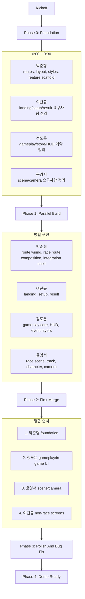
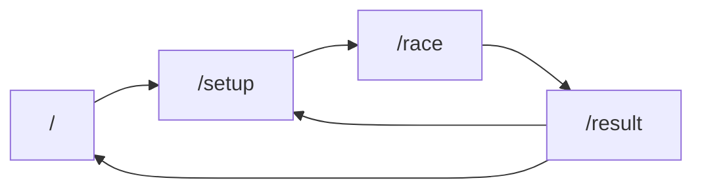
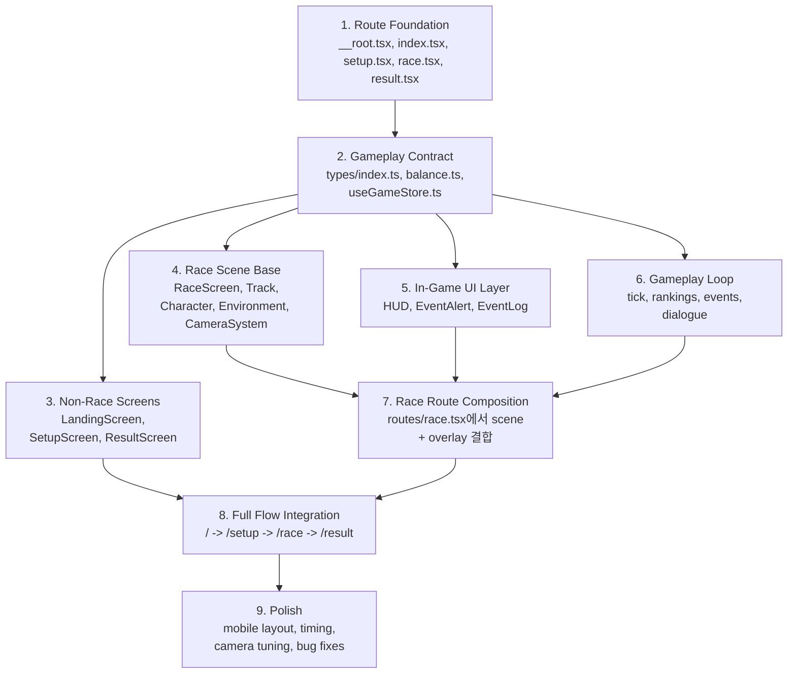
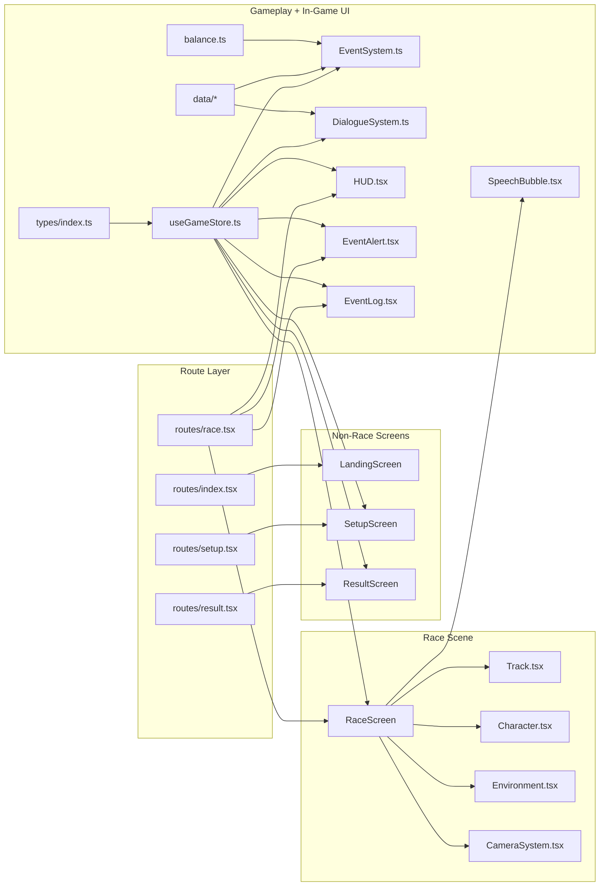

# Plans

이 디렉토리는 `Mountain Race` MVP를 4명이 병렬로 구현하기 위한 실행 계획을 담는다.

## 읽는 순서

1. [mountain-race-team-execution-plan.md](./mountain-race-team-execution-plan.md)
2. [park-junhyeong-plan.md](./park-junhyeong-plan.md)
3. [yeo-changyu-plan.md](./yeo-changyu-plan.md)
4. [jeong-doeun-plan.md](./jeong-doeun-plan.md)
5. [yoon-youngseo-plan.md](./yoon-youngseo-plan.md)

## 문서 역할

- `mountain-race-team-execution-plan.md`: 4인 병렬 작업의 전체 순서, 공통 규칙, 병합 순서, 통합 기준
- `park-junhyeong-plan.md`: foundation, app shell, integration 오너 계획
- `yeo-changyu-plan.md`: landing/setup/result 등 비인게임 화면 오너 계획
- `jeong-doeun-plan.md`: gameplay core, HUD, event layers 오너 계획
- `yoon-youngseo-plan.md`: race scene, track, character, camera, speech bubble 오너 계획

## 단일 원칙

- 박준형이 첫 단계 foundation을 먼저 잡는다.
- 여찬규는 비인게임 화면만 담당한다.
- 정도은과 윤영서는 둘 다 인게임 담당이지만 같은 파일을 수정하지 않는다.
- `routes/race.tsx`의 최종 조합은 박준형만 담당한다.

## 실행 흐름

## route 흐름

## 개발 순서 상세

이 게임은 `route 뼈대 → gameplay 계약 → 비인게임 화면 → 3D 씬 → 인게임 오버레이 → 통합` 순서로 개발한다.

## 충돌 없는 인게임 분리 기준

- 박준형: `routes/race.tsx`와 route-level composition만 담당
- 정도은: `types`, `store`, `systems`, `data`, `HUD`, `EventAlert`, `EventLog`
- 윤영서: `RaceScreen`, `Track`, `Character`, `Environment`, `CameraSystem`, `SpeechBubble`
- 윤영서는 HUD와 로그를 `RaceScreen.tsx`에 직접 붙이지 않는다.
- 정도은은 `RaceScreen.tsx`와 3D 컴포넌트를 직접 수정하지 않는다.

## 정도은 ↔ 윤영서 인터페이스 계약

- 둘은 같은 화면 파일을 같이 수정하지 않는다.
- 정도은은 `types/index.ts`와 `useGameStore.ts`로 인게임 상태 계약을 제공한다.
- 윤영서는 그 계약을 읽어서 `RaceScreen`과 `SpeechBubble`에만 반영한다.
- 박준형이 `routes/race.tsx`에서 `RaceScreen`과 고정 오버레이를 합친다.

공유 상태 키:

- `characters[].id`
- `characters[].name`
- `characters[].color`
- `characters[].faceImage`
- `characters[].progress`
- `characters[].status`
- `rankings`
- `cameraMode`
- `cameraTarget`
- `activeBubble`
- `activeGlobalEvent`
- `finishedIds`

조합 규칙:

- `routes/race.tsx`는 `RaceScreen`, `HUD`, `EventAlert`, `EventLog`를 함께 렌더링한다.
- `SpeechBubble`은 scene anchored element라 `RaceScreen` 내부에서 렌더링한다.
- 정도은은 `RaceScreen.tsx`를 수정하지 않고 HUD 계열만 완성한다.
- 윤영서는 `HUD.tsx`, `EventAlert.tsx`, `EventLog.tsx`를 수정하지 않는다.

## 파일 기준 개발 맵

## 실제로 한 판이 완성되는 방식

1. 박준형이 route와 레이아웃을 정리해서 화면이 들어갈 자리를 만든다.
2. 정도은이 store와 이벤트 계약을 고정해서 인게임의 단일 상태 원본을 만든다.
3. 여찬규가 랜딩, 설정, 결과 화면을 만든다.
4. 윤영서가 race 화면에서 트랙, 캐릭터, 카메라를 올린다.
5. 정도은이 HUD, 이벤트 알림, 이벤트 로그를 붙인다.
6. 윤영서가 scene 내부에서 말풍선을 붙인다.
7. 박준형이 `routes/race.tsx`에서 scene과 고정 overlay를 합친다.
8. 여찬규가 결과 화면에서 최종 순위와 MVP가 읽히는지 맞춘다.
9. 박준형이 route 이동과 redirect를 최종 정리해서 `/setup -> /race -> /result`를 끊기지 않게 연결한다.
10. 마지막으로 2인/8인, 모바일, 첫 골인 후 종료 타이밍을 점검하면서 밸런스를 조정한다.
